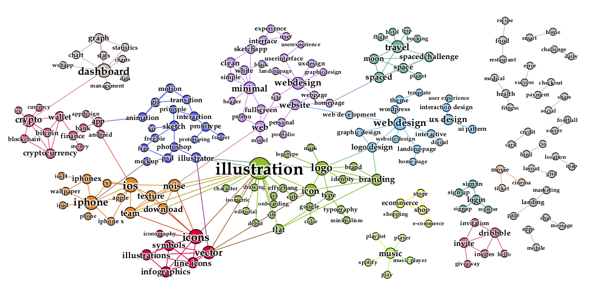

# UI Tag Semantics

This project aimed to distill the semantic association (by [Apriori Algorithm](https://link.springer.com/content/pdf/10.1007/3-540-45372-5_2.pdf)) and construct a vocabulary for UI tags (by [NLTK](https://www.nltk.org/)). With the help of [Gephi](https://gephi.org/) tool, we visualise the landscape within the tags.

<div style="color:#0000FF" align="center">
 
</div>

## Installation

* Download the [Gephi](https://gephi.org/) for your platform

### Compilation

Install all the python dependencies using pip:
```
pip install -r requirements.txt
```

## Usage

```
python semantics.py
```

Optional arguments: 

| Parameter                 | Default       | Description   |	
| :------------------------ |:-------------:| :-------------|
| --support  	            | 0.003         | apriori minimum support threshold
| --confidence              |0.005          | apriori minimum confidence threshold
| --lift 		            |2           	| apriori minimum lift threshold
| --length                |   2        | apriori minimum length threshold
| -h --help                 |               | show this help message and exit

## Authorship

This project is contributed by [Sidong Feng](https://github.com/u6063820).

## License
[](https://www.gnu.org/licenses/old-licenses/gpl-2.0.en.html)